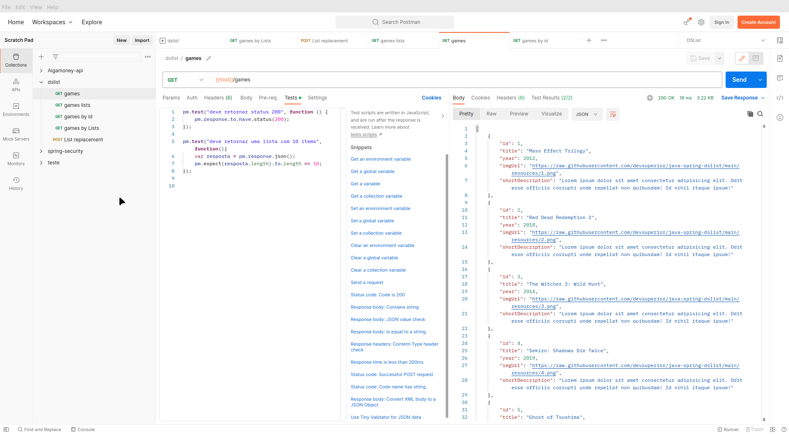

# DSList - API

Projeto de API desenvolvido no evento Intensivão Java Spring, promovido pela escola de programação [#DevSuperior](https://devsuperior.com.br/cursos)

A api funciona com endpoints que retornam uma lista de games, tipos de listas e detalhes informativos sobre o game especificado, e ainda com a possibilidade de reposicionamento do game na lista.

O repositório da api foi integrado com serviço em cloud [Railway](https://railway.app/), que realiza o processo de CI/CD conforme as mudanças no código.

------

------

## Tecnologias

- Java + Springboot

- Banco de dados H2 em memoria

- RailWay

- Postgres

  

------

### Author:

Afrânio Z. Silva

[Linkedin](https://www.linkedin.com/in/afranioz-analista-sistemas/)

